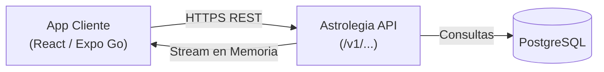

[← Volver al Índice de Tecnología](README.md) | [← Volver al Índice Principal](../index.md)

# 02 — Client Platform

La plataforma de cliente atiende a los **usuarios finales y consultantes** de **Astrolegia**, ofreciendo una experiencia fluida tanto en dispositivos móviles nativos (iOS y Android mediante **Expo Go** / Expo) como en navegación web responsiva.

---

## Superficies de Acceso

| Superficie | Tecnología | Distribución y Modo de Ejecución |
|---|---|---|
| **App Móvil (iOS / Android)** | React Native, Expo Go, TypeScript | Entorno de desarrollo rápido y pruebas en vivo mediante **Expo Go**, distribuible luego vía EAS Build |
| **Web Responsiva** | React, TypeScript, Vite / Expo Web | Acceso directo desde navegadores en móviles, tablets y computadoras de escritorio |

---

## Integración del Design System y Estilos Específicos

El frontend del cliente no crea componentes primitivos desde cero, sino que consume el **Design System unificado** de la plataforma:

1. **Librería Compartida (`@astrolegia/ui`):** Importa botones, modales, campos de formulario, tipografía, tarjetas y selectores astrológicos empaquetados en `packages/ui`.
2. **Capa de CSS y Estilos Específicos del Cliente:** 
   - El cliente dispone de su propia hoja de estilos y configuración de Tailwind/NativeWind para resolver particularidades de la experiencia móvil (paletas místicas, contrastes nocturnos, áreas táctiles adaptadas a pantallas pequeñas y zonas de pulgar).
   - Permite que el diseño visual del cliente evolucione sin alterar la estructura funcional del Design System compartido.

---

## Conexión a la API Unificada

La aplicación del cliente **nunca se conecta directamente a la base de datos PostgreSQL**. Todas las operaciones se realizan mediante llamadas REST seguras a la **API backend unificada**:



### Cabeceras de Versionamiento Obligatorias
Para garantizar compatibilidad con versiones concurrentes de la API (app en producción y app en revisión en tiendas), cada petición HTTP desde el cliente incluye:
- `X-App-Platform`: `ios`, `android`, o `web`.
- `X-App-Version`: Versión semántica de la app (ej. `1.2.0`).
- `X-App-Build`: Número secuencial de compilación (ej. `45`).
- `X-Api-Version`: Versión requerida de la API (ej. `v1`).

### Cold Start y Negociación de Capacidades
Al iniciar la aplicación o tras un login, el cliente consulta:
```http
GET /v1/capabilities
```
La respuesta informa sobre características habilitadas, mantenimiento programado y versión mínima de compilación soportada (`minSupportedBuild`). Si la app en producción requiere una actualización obligatoria, la UI muestra un diálogo informativo.

---

## Autenticación (Google SSO Inicial)

- El inicio de sesión y registro de usuarios se realiza exclusivamente mediante **Single Sign-On con Google**.
- En móviles, Expo utiliza `expo-auth-session` o el flujo de Better Auth configurado para Google OAuth.
- No se admiten contraseñas locales ni otros proveedores sociales inicialmente (sin Apple, Facebook ni Instagram).
- Los tokens de sesión se almacenan de forma segura (e.g. `expo-secure-store` en móviles o cookies HTTP-only en web).

---

## Descarga de Reportes y Documentos en Streaming

- Cuando el usuario solicita su Carta Natal o un Informe Astrológico, el cliente invoca el endpoint correspondiente (ej. `GET /v1/astrology/natal-chart/pdf`).
- El backend genera el documento en memoria en tiempo de ejecución y lo entrega por **HTTP chunked streaming**.
- El cliente móvil recibe el flujo directamente en memoria o en un archivo temporal de caché de la app para visualizarlo de inmediato o compartirlo usando el menú nativo del dispositivo (`expo-sharing`).
- **No se consumen URLs de buckets ni almacenamiento estático**.

---

## Buenas Prácticas para la Experiencia de Usuario Móvil

- **Diseño a partir de 320px** de ancho con layouts responsivos.
- **Objetivos táctiles de al menos 44–48px** para garantizar facilidad de toque.
- **Acciones principales en la zona del pulgar** (navegación inferior en teléfonos).
- **Estados de carga (skeletons) y manejo de errores visible** en todas las pantallas asíncronas.
- **Cero dependencias de almacenamiento en la nube para subidas de archivos**, simplificando al máximo los permisos de la app en iOS y Android.
