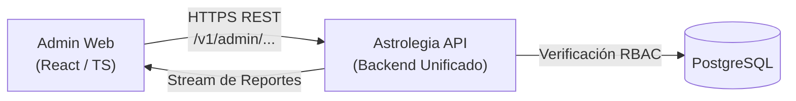

[← Volver al Índice de Tecnología](README.md) | [← Volver al Índice Principal](../index.md)

# 03 — Admin Platform

La plataforma de administración está destinada a los **operadores y administradores internos de Astrolegia**. Proporciona herramientas de gestión de consultantes, configuración de parámetros astrológicos, moderación y visualización de auditoría operativa.

---

## Superficie de Acceso

| Superficie | Tecnología | Notas de Despliegue |
|---|---|---|
| **Admin Web** | React, TypeScript, Vite / Next.js | Aplicación web de escritorio optimizada para pantallas medianas y grandes, responsiva para tablets. |

> **Nota Confirmada:** No existe aplicación móvil para administración. Todas las funciones operativas se gestionan desde el navegador web.

---

## Integración del Design System y Estilos Específicos

Al igual que el frontend del cliente, la plataforma administrativa reutiliza el ecosistema común de UI:

1. **Librería Compartida (`@astrolegia/ui`):** Importa los componentes centrales empaquetados en `packages/ui` (botones, campos de texto, modales de confirmación, tablas, tarjetas, tooltips y badges de estado).
2. **Capa de CSS y Estilos Específicos de Administración:**
   - Hoja de estilos y configuración de Tailwind optimizada para densidad de datos (data-dense tables, barras laterales de navegación fija, paneles colapsables y dashboards de gestión).
   - Mantiene una separación limpia entre la lógica del componente compartido y la presentación densa requerida por un panel de control.

---

## Conexión a la API Backend Unificada

El frontend administrativo interactúa exclusivamente con la **única API backend** de Astrolegia a través de rutas dedicadas y protegidas por roles:

### Rutas Clave de Administración
- `/v1/admin/users`: Gestión y consulta de consultantes registrados.
- `/v1/admin/astrology`: Parámetros de efemérides, orbes y plantillas de reportes.
- `/v1/admin/audit`: Consulta de logs de auditoría de cambios en el sistema.
- `/v1/admin/reports/stream-pdf`: Previsualización de reportes astrológicos generados en runtime por streaming.

---

## Autenticación (Google SSO Exclusivo)

- El acceso al panel de administración se realiza exclusivamente mediante **Single Sign-On con Google**.
- **Lista de Acceso y Roles en PostgreSQL:** La autenticación exitosa con Google no otorga acceso automático. La API backend verifica que el correo electrónico pertenezca a la tabla `admin_users` y que el estado sea activo.
- Si el usuario no existe en `admin_users`, la sesión es rechazada inmediatamente con código HTTP 403 Forbidden.

---

## Modelo de Autorización (RBAC)

La administración opera bajo control de acceso basado en roles (**RBAC**) definido a nivel de PostgreSQL y validado por guards en la API:

| Rol | Alcance de Permisos |
|---|---|
| **`viewer`** | Lectura operacional de usuarios, reportes y métricas básicas. Sin permisos de modificación. |
| **`editor`** | Modificación de textos, interpretaciones astrológicas, parámetros de orbes y plantillas. |
| **`super_admin`** | Control total: gestión de roles y personal administrativo, configuraciones críticas y acciones destructivas. |

---

## Registro de Auditoría (`admin_audit`)

Toda mutación ejecutada desde la plataforma administrativa que altere datos en PostgreSQL se registra de forma obligatoria y transaccional en la tabla `admin_audit`:

| Campo | Ejemplo | Descripción |
|---|---|---|
| `actor_id` | `uuid-admin-123` | ID del administrador autenticado que ejecuta la acción |
| `action` | `astrology.orbs.update` | Nombre calificado de la acción |
| `entity_type` | `astrological_configuration` | Entidad afectada |
| `entity_id` | `cfg-456` | Identificador del registro modificado |
| `payload` | `{ "sun_trine_moon": 8.5 }` | Diff o snapshot de los datos modificados |
| `ip_address` | `203.0.113.1` | Dirección IP de origen |
| `created_at` | `2026-09-02T...` | Marca de tiempo UTC |
