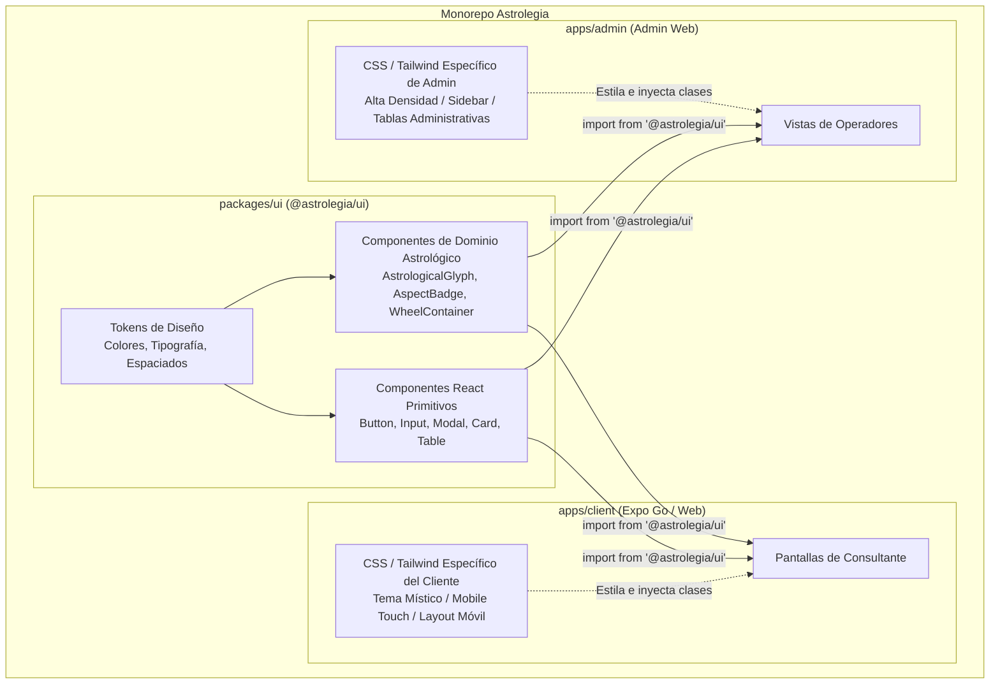

[← Volver al Índice de Tecnología](README.md) | [← Volver al Índice Principal](../index.md)

# 04 — Design System Unificado (`@astrolegia/ui`)

Para garantizar coherencia de marca, acelerar el desarrollo y evitar la duplicación de código, **Astrolegia** implementa un **Design System unificado** empaquetado en el monorepo como la librería `@astrolegia/ui` (`packages/ui`).

Ambos proyectos (`apps/client` y `apps/admin`) consumen estos componentes React de la misma manera que importarían una librería externa de terceros, pero **mantienen su propio CSS y capa de estilos independientes** para atender los requerimientos específicos de cada superficie.

---

## Arquitectura de la Librería Compartida



---

## Estrategia de CSS Desacoplado por Frontend

Un desafío recurrente en sistemas compartidos es evitar que los estilos específicos de un panel administrativo contaminen la app móvil/cliente o viceversa. Astrolegia resuelve esto mediante **componentes desacoplados con inyección de CSS local**:

### 1. Componentes Base Estructurados (Headless o Class-Driven)
Los componentes en `@astrolegia/ui` exponen una estructura funcional y accesible (accesibilidad ARIA, gestión de teclado, estados de foco y carga), aceptando propiedades de personalización (`className`, `variant`, `size` o slots de estilo).

```tsx
// Ejemplo de uso en cualquier frontend:
import { Button, Card } from '@astrolegia/ui';

export function NatalChartCard() {
  return (
    <Card className="astro-client-card">
      <Button variant="primary" className="w-full md:w-auto">
        Ver Carta Natal
      </Button>
    </Card>
  );
}
```

### 2. Capa de Estilos en `apps/client`
- **Enfoque Visual:** Místico, nocturno, enfocado en navegación móvil, zonas táctiles amplias (mínimo 44px) y transiciones fluidas.
- **Configuración:** Archivo de configuración Tailwind / NativeWind en `apps/client` que define tokens de espaciado para pantallas táctiles y clases utilitarias para la experiencia de consultantes.

### 3. Capa de Estilos en `apps/admin`
- **Enfoque Visual:** Limpio, de alta densidad informativa, con barras de herramientas compactas, tablas de auditoría detalladas y paneles laterales.
- **Configuración:** Archivo de configuración Tailwind en `apps/admin` que prioriza grillas de datos compactas, contraste funcional para operadores de oficina y tipografías neutras legibles.

---

## Sistema de Tokens de Diseño

`packages/ui` centraliza los tokens base que definen la identidad de Astrolegia:

| Token | Valores Clave | Uso |
|---|---|---|
| **Paleta de Identidad** | Azul Medianoche (`#0D1117`), Púrpura Astral (`#2A1B4E`), Oro Celestial (`#D4AF37`) | Identidad visual de la marca y acentos destacados |
| **Paleta de Soporte** | Blanco Estelar, Grises Neutros (50 a 900), Rojo Alerta, Verde Éxito | Superficies, textos de lectura, estados de formulario y validaciones |
| **Tipografía** | Serif para títulos de cartas y marcas; Sans-serif clara (Inter/Geist) para UI | Legibilidad óptima en pantallas pequeñas y tablas de datos |
| **Espaciado y Radio** | Escala estándar de 4px (4, 8, 12, 16, 24, 32, 48px); Radios `md` (8px), `lg` (12px), `full` | Consistencia espacial y bordes suaves |

---

## Catálogo de Componentes Compartidos

1. **Componentes Primitivos de UI:**
   - `Button`: Botones primarios, secundarios, fantasma y con estado de carga.
   - `TextInput`, `Select`, `DatePicker`: Entradas de datos accesibles para fecha y hora de nacimiento.
   - `Modal` / `Dialog`: Ventanas modales y confirmaciones destructivas.
   - `Card`: Contenedores de contenido y perfiles.
   - `Badge` / `Tag`: Etiquetas de estado (activo, pendiente, rol de usuario).
   - `Table`: Estructura accesible para tablas de datos (paginación, ordenamiento).

2. **Componentes Específicos del Dominio Astrológico:**
   - `AstrologicalGlyph`: Renderizado SVG vectorial de planetas (Sol, Luna, Mercurio, etc.) y signos zodiacales.
   - `AspectBadge`: Indicador visual de aspectos planetarios (conjunción, oposición, trígono, cuadratura, sextil).
   - `WheelContainer`: Contenedor responsivo optimizado para renderizar la rueda de la carta astral.

---

## Beneficios para el Proyecto

- **Una Sola Fuente de Verdad para UI:** Si un componente de formulario o glifo astrológico se actualiza, la mejora está disponible de inmediato para ambos frontends.
- **Sin Fricción de Estilos:** El administrador no se ve forzado a usar estilos móviles gigantes, y el cliente móvil no sufre la rigidez de una interfaz de administración de escritorio.
- **Mantenimiento Simplificado:** Permite al equipo de desarrollo avanzar a gran velocidad mediante el monorepo sin publicar paquetes a registros públicos de npm.
