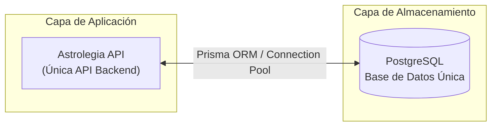
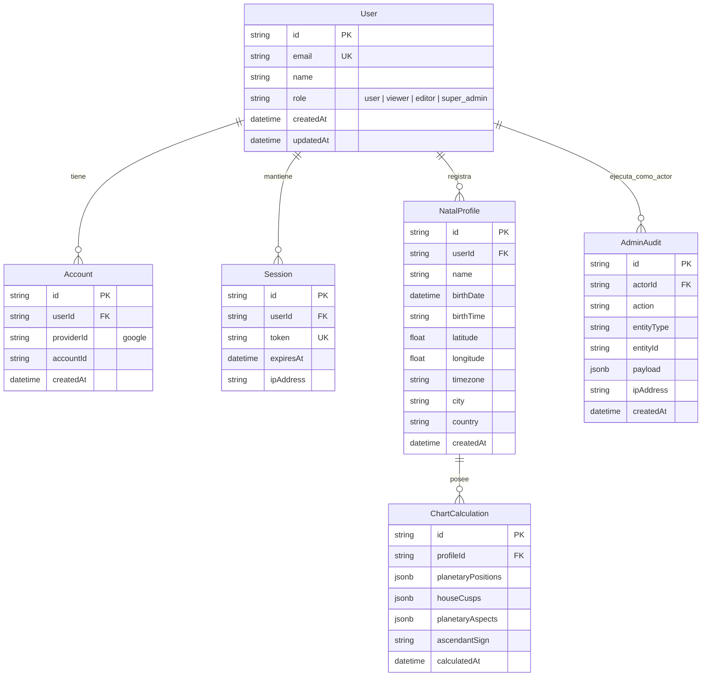

[← Volver al Índice de Tecnología](README.md) | [← Volver al Índice Principal](../index.md)

# 05 — Data Architecture

La arquitectura de datos de **Astrolegia** se basa en un principio de máxima simplicidad: **una única base de datos PostgreSQL** actúa como fuente de la verdad transaccional y analítica del sistema. 

Se eliminan por completo almacenes secundarios de analítica (sin Google BigQuery), tuberías ETL y workers periódicos de sincronización. Todas las consultas —tanto del cliente como de administración— son atendidas directamente por PostgreSQL a través de la API unificada.

---

## Topología de Datos

| Componente | Rol |
|---|---|
| **PostgreSQL** | Almacén unificado de datos (usuarios, perfiles natales, cartas astrales, configuraciones y auditoría) |
| **Prisma ORM** | Capa de abstracción, migraciones versionadas y tipado seguro en `packages/database` |
| **Connection Pooling** | Gestión eficiente de conexiones concurrentes para la API |

---

## Esquema Lógico de Datos (PostgreSQL)

El esquema de datos está estructurado en torno a tres pilares del dominio:

---

## Modelo de Entidades Principales

### 1. Autenticación e Identidad (Better Auth)
- **`User`:** Datos maestros del usuario (correo, nombre, avatar y rol del sistema: `user`, `viewer`, `editor`, `super_admin`).
- **`Account`:** Vinculación de la cuenta con el proveedor Google OAuth.
- **`Session`:** Sesiones activas con tokens seguros de expiración para web y móvil.

### 2. Dominio Astrológico
- **`NatalProfile`:** Información natal ingresada por el consultante (fecha, hora exacta, coordenadas geográficas, zona horaria y lugar de nacimiento).
- **`ChartCalculation`:** Cálculos astronómicos/astrológicos generados por el motor de efemérides (posiciones planetarias, signos, casas y aspectos angulares). Almacenados en campos `JSONB` indexados para lectura ultrarrápida.

### 3. Operación y Auditoría
- **`AdminAudit`:** Registro inmutable de cada acción administrativa ejecutada en el sistema para trazabilidad y seguridad.

---

## Estrategia de Índices y Optimización

PostgreSQL ofrece un rendimiento excepcional para el volumen de Astrolegia mediante una indexación planificada:

1. **Búsquedas de Identidad:**
   - `CREATE UNIQUE INDEX idx_user_email ON "User"(email);`
   - `CREATE UNIQUE INDEX idx_session_token ON "Session"(token);`
2. **Consultas por Consultante:**
   - `CREATE INDEX idx_natal_profile_user ON "NatalProfile"(userId);`
3. **Lecturas de Cálculos y Reportes:**
   - `CREATE INDEX idx_chart_profile ON "ChartCalculation"(profileId);`
   - Índices GIN sobre columnas `JSONB` si se requieren búsquedas analíticas por aspectos planetarios específicos:
     `CREATE INDEX idx_chart_aspects_gin ON "ChartCalculation" USING gin (planetaryAspects);`
4. **Logs de Auditoría:**
   - `CREATE INDEX idx_admin_audit_created ON "AdminAudit"(createdAt DESC);`

---

## Migraciones y Control de Esquema

- Todas las modificaciones de esquema se declaran en el archivo `packages/database/prisma/schema.prisma`.
- El despliegue de migraciones en entornos de staging y producción se ejecuta de forma automatizada en el pipeline de CI/CD mediante `prisma migrate deploy`.
- Las mutaciones destructivas de tablas requieren aprobación explícita en revisión de código.
