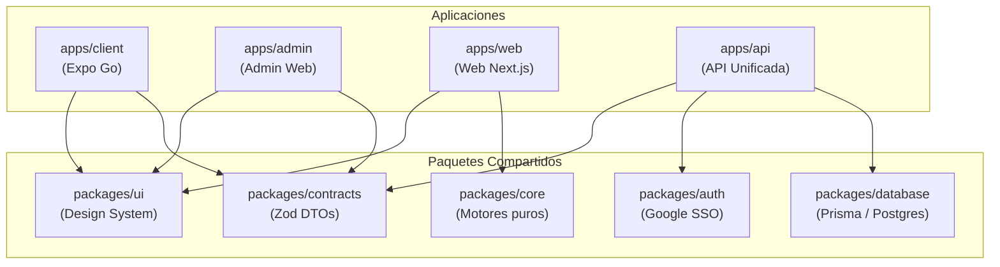

[← Volver al Índice de Tecnología](README.md) | [← Volver al Índice Principal](../index.md)

# 06 — Monorepo Structure

La plataforma **Astrolegia** está organizada en un repositorio único gestionado mediante **Turborepo** y **pnpm workspaces**. Esta estructura permite compartir el Design System, tipos y contratos de API entre aplicaciones, manteniendo una estricta separación de responsabilidades y pipelines de compilación incrementales ultrarrápidos.

---

## Estructura de Directorios

```
astrolegia/
├── apps/
│   ├── api/                    # Única API backend (Node.js / NestJS / TypeScript)
│   ├── client/                 # Frontend usuario final (React + Expo Go + TypeScript)
│   ├── admin/                  # Frontend administración (React + TypeScript Web)
│   └── web/                    # Web de consultantes migrada de Astrolegia v1 (Next.js) — ver ADR-0001
│
├── packages/
│   ├── ui/                     # Design System (@astrolegia/ui) — componentes React compartidos
│   ├── core/                   # Motores puros (@astrolegia/core): efemérides, rueda zodiacal, numerología, personas
│   ├── database/               # Prisma ORM, migraciones y cliente PostgreSQL
│   ├── contracts/              # Esquemas Zod y DTOs compartidos (API ↔ Clientes)
│   ├── auth/                   # Configuración Better Auth y validación de Google SSO
│   └── tsconfig/               # Configuraciones base de TypeScript
│
├── docs/                       # Documentación técnica de arquitectura
│   └── technology/
├── turbo.json                  # Pipeline de tareas (build, test, lint, dev)
├── pnpm-workspace.yaml         # Definición de workspaces
└── package.json                # Dependencias raíz del monorepo
```

---

## Aplicaciones (`apps/`)

| Aplicación | Stack | Destino de Despliegue / Ejecución | Responsabilidad |
|---|---|---|---|
| **`api`** | Node.js, NestJS / Fastify, TypeScript | Railway (Servicio Web) | Única API backend. Concentra la conexión a PostgreSQL, autenticación Google SSO, endpoints cliente, administración (RBAC) y streaming de PDFs. |
| **`client`** | React, Expo Go (React Native), TypeScript | Expo Go / EAS / Web | Experiencia móvil y web para consultantes de Astrolegia. Consume `@astrolegia/ui` con estilos propios. |
| **`admin`** | React, Vite / Next.js, TypeScript | Railway (Servicio Web) | Panel de administración y auditoría operativa. Consume `@astrolegia/ui` con CSS propio de alta densidad. |
| **`web`** | React, Next.js 16 (App Router), TypeScript, Tailwind 3 | Vercel | Web de consultantes migrada de Astrolegia v1 (home, dashboard, personas + carta natal, numerología, calendario). Consume `@astrolegia/ui` y `@astrolegia/core`. Persistencia transitoria en Firebase: ver [ADR-0001](./adr/0001-migracion-astrolegia-v1.md). |

---

## Paquetes Compartidos (`packages/`)

| Paquete | Consumidores | Propósito |
|---|---|---|
| **`ui` (`@astrolegia/ui`)** | `apps/client`, `apps/admin`, `apps/web` | Design System unificado: componentes React (botones, modales, campos, glifos astrológicos) y tokens de diseño. Sin estilos CSS fijos acoplados. |
| **`core` (`@astrolegia/core`)** | `apps/web` (y a futuro `apps/api`, `apps/client`) | Motores puros de dominio en TypeScript, sin React ni I/O: efemérides y favorabilidad (`astronomy-engine`), geometría de la rueda zodiacal, numerología Hitchcock, modelo canónico de personas. Testeado con vitest. |
| **`database`** | `apps/api` | Esquema de Prisma, migraciones automáticas y cliente tipado para PostgreSQL. **Solo la API backend tiene acceso a este paquete**. |
| **`contracts`** | `apps/api`, `apps/client`, `apps/admin` | Definiciones TypeScript y esquemas de validación en tiempo de ejecución (Zod) para peticiones y respuestas de la API. |
| **`auth`** | `apps/api` | Lógica compartida de verificación de tokens de Google OAuth y adaptadores de Better Auth. |
| **`tsconfig`** | Todos los proyectos | Configuraciones estándar de compilación TypeScript (`base`, `react`, `node`). |

---

## Reglas de Dependencias



### Principios de Aislamiento
1. **Los frontends nunca acceden a `packages/database`:** Ningún código cliente tiene dependencias del cliente de base de datos ni credenciales directas a PostgreSQL.
2. **`packages/ui` es agnóstico del backend:** El Design System no depende de contratos de API ni de capas de persistencia; únicamente contiene componentes visuales y tokens.
3. **Contratos tipados punto a punto:** La modificación de un DTO en `packages/contracts` genera errores de compilación inmediatos en la API y en los frontends si se rompe la compatibilidad.
