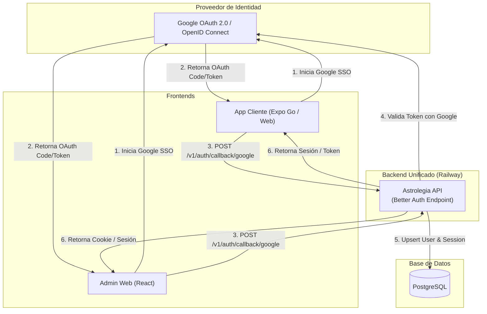

[← Volver al Índice de Tecnología](README.md) | [← Volver al Índice Principal](../index.md)

# 07 — Authentication (Google SSO)

En **Astrolegia**, la autenticación se gestiona exclusivamente mediante **Single Sign-On (SSO) con Google** tanto para el frontend de usuarios finales como para el panel de administración. 

No se almacenan contraseñas locales ni se configuran proveedores sociales adicionales (se descartan Apple, Facebook e Instagram en esta fase inicial). Esto reduce drásticamente los vectores de ataque, simplifica la experiencia de usuario y minimiza el código de autenticación en el monorepo.

---

## Flujo de Identidad Unificado

La **única API backend** actúa como centro de verificación y gestión de sesiones mediante la integración con **Better Auth**:

---

## Proveedores y Alcance

| Superficie | Proveedor Soportado | Método de Validación | Rol Asignado por Defecto |
|---|---|---|---|
| **Cliente (Usuario Final)** | **Google SSO** | ID Token / OAuth Code exchange | `user` |
| **Administración Web** | **Google SSO** | ID Token / OAuth Code exchange | Requiere rol preexistente (`viewer`, `editor`, `super_admin`) |

---

## Diferenciación y Autorización de Roles

Aunque ambos frontends usan el mismo proveedor (Google SSO), la API backend diferencia estrictamente el acceso a recursos:

1. **Usuarios Finales (`role = 'user'`):**
   - Se crean automáticamente tras el primer inicio de sesión con Google.
   - Acceso permitido exclusivamente a rutas `/v1/client/...` y endpoints públicos.
   - Restringidos para consultar únicamente sus propios datos natales y cartas generadas.

2. **Administradores (`viewer`, `editor`, `super_admin`):**
   - El inicio de sesión con Google valida el correo electrónico contra la base de datos PostgreSQL.
   - Si el usuario no tiene un rol administrativo asignado previamente en la tabla `User` (o tabla de control administrativo), la API deniega inmediatamente cualquier intento de acceso a rutas `/v1/admin/...` devolviendo `403 Forbidden`.
   - El primer usuario `super_admin` se configura mediante variables de entorno o migración semilla (seed) en el despliegue inicial.

---

## Ciclo de Vida de la Sesión y Almacenamiento

| Entorno | Mecanismo de Almacenamiento | Duración y Rotación |
|---|---|---|
| **Admin Web** | Cookie segura (`HttpOnly`, `SameSite=Lax`, `Secure`) | Sesión de 7 días con renovación activa en cada petición. |
| **Cliente Web** | Cookie segura (`HttpOnly`, `SameSite=Lax`, `Secure`) | Sesión de 30 días. |
| **Cliente Mobile (Expo Go)** | Bearer Token persistido en `expo-secure-store` (Keystore / Keychain) | Token de sesión firmado con tiempo de vida extendido (30 días) y revocación en servidor. |

### Cierre de Sesión y Revocación
Cuando un usuario presiona "Cerrar Sesión", el frontend invoca `POST /v1/auth/sign-out`. La API backend invalida el registro de la sesión en PostgreSQL, garantizando que el token o cookie deje de ser válido de inmediato en todos los dispositivos.
