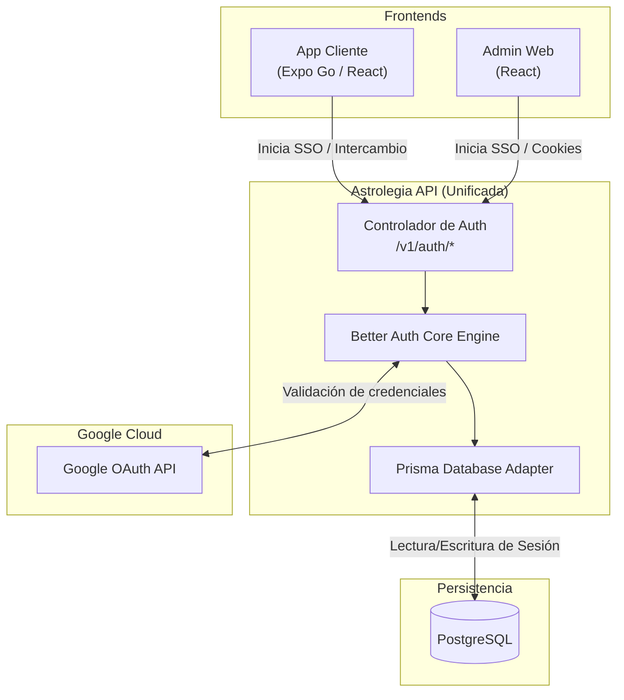

[← Volver al Índice de Tecnología](README.md) | [← Volver al Índice Principal](../index.md)

# 08 — Better Auth Integration

**Better Auth** es la librería de autenticación de código abierto adoptada por **Astrolegia**. Proporciona una solución integral para la gestión de usuarios, sesiones seguras, rotación de tokens y flujos de **Single Sign-On (SSO) con Google**, eliminando la necesidad de implementar código personalizado de intercambio OAuth o servicios de autenticación de terceros propietarios.

---

## Montaje en la API Backend Unificada

En la arquitectura previa existían instancias fragmentadas de autenticación. En Astrolegia, Better Auth se ejecuta de forma centralizada **dentro de la única API backend**, exponiendo los endpoints estándar bajo el prefijo `/v1/auth/*`:



---

## Configuración del Proveedor Google

La configuración de Better Auth se define en `packages/auth` y se inyecta en la API backend:

```typescript
import { betterAuth } from "better-auth";
import { prismaAdapter } from "better-auth/adapters/prisma";
import { prisma } from "@astrolegia/database";

export const auth = betterAuth({
  database: prismaAdapter(prisma, {
    provider: "postgresql",
  }),
  socialProviders: {
    google: {
      clientId: process.env.GOOGLE_CLIENT_ID!,
      clientSecret: process.env.GOOGLE_CLIENT_SECRET!,
    },
  },
  session: {
    expiresIn: 60 * 60 * 24 * 30, // 30 días
    updateAge: 60 * 60 * 24,       // Actualizar cada 24h de actividad
  },
  trustedOrigins: [
    process.env.CLIENT_URL || "http://localhost:3000",
    process.env.ADMIN_URL || "http://localhost:3001",
    "exp://*", // Permitir esquema de desarrollo de Expo Go
  ],
});
```

---

## Clientes de Autenticación en Frontends

Ambas aplicaciones frontends utilizan los SDKs de cliente de Better Auth para iniciar sesión y mantener el estado del usuario:

### 1. En `apps/admin` (Web)
Usa el cliente web estándar con cookies seguras automáticas:
```typescript
import { createAuthClient } from "better-auth/react";

export const authClient = createAuthClient({
  baseURL: process.env.VITE_API_URL + "/v1/auth",
});

export const signInWithGoogle = () => {
  return authClient.signIn.social({
    provider: "google",
    callbackURL: "/dashboard",
  });
};
```

### 2. En `apps/client` (Expo Go / React Native)
Usa el adaptador compatible con móviles y Expo:
- Se abre la ventana de autenticación del navegador del sistema mediante `expo-web-browser` o `expo-auth-session`.
- Tras la confirmación en Google, la URL de redirección devuelve el código a la app.
- El token de sesión obtenido se persiste automáticamente en el almacenamiento seguro nativo (`expo-secure-store`).

---

## Ventajas para Astrolegia

- **Sin Costos por Usuario Activo:** Al ser una solución open source autohospedada sobre PostgreSQL, no hay costos mensuales por volumen de usuarios (a diferencia de Auth0 o Clerk).
- **Control Total de Datos:** Toda la información de cuentas, perfiles y sesiones reside en la base de datos PostgreSQL de Astrolegia.
- **Un Solo Punto de Verificación:** La API backend resuelve los permisos del usuario en la misma llamada de autenticación, simplificando los guards de seguridad y reduciendo la latencia de red.
