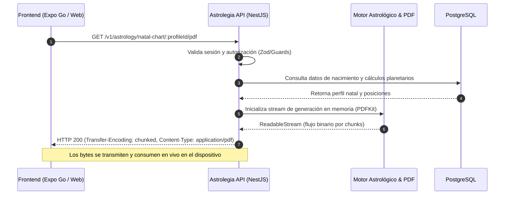

[← Volver al Índice de Tecnología](README.md) | [← Volver al Índice Principal](../index.md)

# 09 — Runtime Document Generation & Direct Streaming

Una de las simplificaciones arquitectónicas más relevantes de **Astrolegia** es la **eliminación total de almacenamiento de archivos persistente**. 

La plataforma **no utiliza buckets de almacenamiento en la nube** (sin Amazon S3 ni Railway Storage Buckets) ni guarda archivos en discos locales del servidor. Cualquier documento solicitado —como la Carta Natal en PDF, sinastrias o reportes de tránsitos planetarios— se **crea dinámicamente en tiempo de ejecución (runtime) en memoria y se sirve directamente al cliente mediante HTTP Streaming**.

---

## Flujo de Generación y Streaming en Memoria



---

## Mecánica de Implementación del Streaming

En el backend, el motor de generación escribe directamente en un flujo de lectura (`ReadableStream`) que se conecta en tubería (*pipe*) a la respuesta HTTP del framework (Express / Fastify en NestJS):

```typescript
import { Controller, Get, Param, Res, UseGuards } from '@nestjs/common';
import { Response } from 'express';
import PDFDocument from 'pdfkit';

@Controller('v1/astrology')
export class AstrologyReportsController {
  @Get('natal-chart/:profileId/pdf')
  async streamNatalChart(
    @Param('profileId') profileId: string,
    @Res() res: Response
  ) {
    // 1. Obtener datos astrológicos desde PostgreSQL
    const chartData = await this.astrologyService.getChartData(profileId);

    // 2. Configurar cabeceras HTTP de streaming
    res.setHeader('Content-Type', 'application/pdf');
    res.setHeader(
      'Content-Disposition',
      `inline; filename="carta-natal-${profileId}.pdf"`
    );
    res.setHeader('Transfer-Encoding', 'chunked');

    // 3. Crear documento PDF en memoria
    const doc = new PDFDocument({ size: 'A4', margin: 40 });

    // 4. Conectar directamente el documento al stream de respuesta HTTP
    doc.pipe(res);

    // 5. Dibujar la rueda zodiacal y redactar el reporte
    this.pdfDrawingService.renderNatalWheel(doc, chartData);
    this.pdfDrawingService.renderInterpretations(doc, chartData);

    // 6. Finalizar el flujo
    doc.end();
  }
}
```

---

## Consumo en los Frontends

### 1. App Móvil (React Native / Expo Go)
- La aplicación móvil solicita el documento y recibe el flujo binario.
- Puede utilizar `FileSystem.createDownloadResumable` o guardar temporalmente el buffer en el directorio de caché volátil de la app (`FileSystem.cacheDirectory`).
- Permite abrir el visualizador de PDF nativo o compartir el informe inmediatamente a través del menú del sistema (`expo-sharing`). Al cerrar la app, el sistema operativo limpia la caché cuando sea necesario.

### 2. Navegador Web (Cliente y Admin)
- La respuesta con cabecera `Content-Disposition: inline` permite abrir el PDF directamente en una pestaña del navegador o renderizarlo embebido mediante un visor estándar.

---

## Ventajas Arquitectónicas y de Seguridad

| Beneficio | Impacto en Astrolegia |
|---|---|
| **Cero Costos de Almacenamiento** | No existen facturas por gigabytes almacenados en buckets ni costos por peticiones PUT/GET en almacenamiento de objetos. |
| **Tiempo al Primer Byte Ultrarrápido (TTFB)** | El cliente comienza a recibir los primeros bytes del PDF casi de inmediato, sin tener que esperar a que el archivo completo se guarde en disco o se suba a un bucket remoto. |
| **Eliminación de la Superficie de Ataque por Archivos** | Dado que los usuarios **nunca suben archivos arbitrarios** al sistema y los PDFs se generan a partir de datos validados en PostgreSQL, **se elimina la necesidad de antivirus como ClamAV, análisis de malware o carpetas de cuarentena**. |
| **Sin Enlaces Expirados ni Fugas de URLs** | No existen URLs públicas de buckets que puedan quedar expuestas o links prefirmados temporales que expiren y frustren al consultante. |
| **Datos Siempre Actualizados** | Si el usuario corrige la hora de nacimiento de su perfil en la app, la próxima descarga del PDF refleja el cálculo astronómico exacto al instante. |
