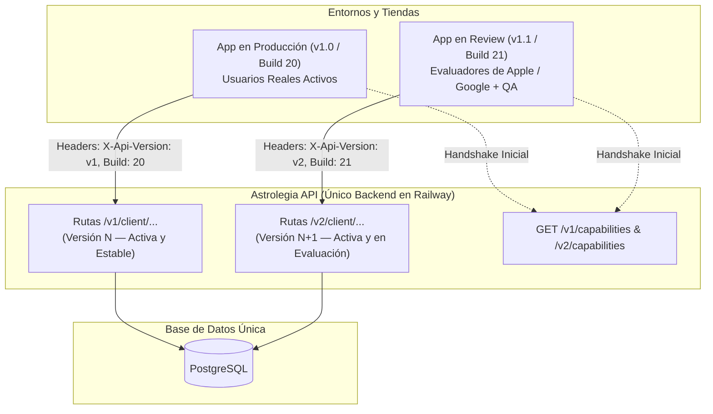

[← Volver al Índice de Tecnología](README.md) | [← Volver al Índice Principal](../index.md)

# 14 — API Versioning & Simultaneous App Lifecycle

Una de las premisas arquitectónicas críticas de **Astrolegia** es la garantía de que **la API backend soporta múltiples versiones activas en simultáneo**, permitiendo que una versión de la app móvil esté en producción en los teléfonos de los usuarios mientras otra versión diferente se encuentra en proceso de revisión (*app review*) en Apple App Store o Google Play Store.

---

## El Desafío del Ciclo de Vida Móvil

A diferencia de las aplicaciones web que se actualizan de forma instantánea al recargar la página, las aplicaciones móviles sufren desfases inevitables:

| Superficie | Tiempo de Despliegue | Tiempo de Adopción por el Usuario |
|---|---|---|
| **API Backend (Railway)** | ~2 minutos | Inmediato para todas las peticiones entrantes |
| **Admin Web (React)** | ~2 minutos | Inmediato en la próxima carga de navegador |
| **App Móvil en Producción ($N$)** | Días a semanas | Lento; muchos usuarios tardan semanas en actualizar |
| **App Móvil en Review ($N+1$)** | Variable (24h a 7 días) | Accedida activamente por los evaluadores de Apple / Google |

> [!IMPORTANT]
> Si el backend solo soportara una versión de la API a la vez, desplegar cambios para la versión en revisión rompería la app de los usuarios en producción. A la inversa, no desplegar los cambios provocaría el rechazo de la app por parte de los revisores de las tiendas al fallar las pruebas.

---

## Modelo de Coexistencia Simultánea ($N$ y $N+1$)

Para resolver este desafío, la API de Astrolegia implementa un **modelo de versiones concurrentes en paralelo**:



---

## Mecanismos Técnicos para Garantizar la Coexistencia

### 1. Versionamiento Explícito en URI (`/v1`, `/v2`)
- La API backend mantiene controladores y rutas separadas para cambios incompatibles:
  - `/v1/client/astrology/natal-chart`
  - `/v2/client/astrology/natal-chart`
- Ambos controladores reutilizan los servicios de dominio subyacentes y la misma base de datos PostgreSQL, adaptando las respuestas según el contrato correspondiente.

### 2. Cabeceras de Identificación de Compilación
Cada petición emitida por la app móvil (tanto en producción como en review) incluye cabeceras HTTP obligatorias:
- `X-App-Platform`: `ios` o `android`.
- `X-App-Version`: Versión semántica (ej. `1.0.0` para producción; `1.1.0` para review).
- `X-App-Build`: Número secuencial de compilación (ej. `20` frente a `21`).
- `X-Api-Version`: Versión de API esperada (`v1` o `v2`).

Esto permite a la API registrar métricas, detectar comportamientos específicos por versión de compilación y habilitar flags condicionales si fuera necesario.

### 3. Negociación y Handshake de Capacidades (`GET /v*/capabilities`)
Tanto `/v1/capabilities` como `/v2/capabilities` informan a la aplicación sobre su estado operativo:

```json
{
  "data": {
    "apiVersion": "v2",
    "minSupportedBuild": 20,
    "latestBuild": 21,
    "storeReviewActive": true,
    "features": {
      "extendedTransits": true
    }
  }
}
```
- Para la app en producción (Build 20): Como `minSupportedBuild <= 20`, la app sigue funcionando con normalidad.
- Para la app en review (Build 21): Opera contra `/v2` sin interferir con la base de usuarios en `/v1`.

### 4. Compatibilidad Retroactiva en Base de Datos
Las migraciones de PostgreSQL en `packages/database` se diseñan con la regla de **adición no destructiva**:
- **Permitido:** Agregar nuevas columnas con valores por defecto o nulables, crear nuevas tablas, añadir índices.
- **Prohibido en transiciones:** Eliminar o renombrar columnas que la versión $N$ aún utiliza. La eliminación física de campos obsoletos solo se realiza una vez que la versión $N$ ha sido completamente discontinuada (*sunset*).

---

## Ciclo de Vida y Ventana de Deprecación (*Sunset Window*)

1. **Fase de Desarrollo y Review:** `/v1` está en producción y `/v2` se despliega en staging y producción para uso del build en revisión.
2. **Aprobación y Lanzamiento:** La app $N+1$ es aprobada en tiendas y se libera al público.
3. **Ventana de Coexistencia (30–60 días):** `/v1` y `/v2` permanecen activas simultáneamente en producción mientras los usuarios van actualizando la app en sus dispositivos.
4. **Alerta de Actualización Suave:** Al cumplirse el plazo, `GET /v1/capabilities` notifica a los usuarios rezagados que existe una nueva versión recomendada.
5. **Cierre Definitivo de Versión:** Cuando el tráfico en `/v1` es despreciable, se eleva `minSupportedBuild` a `21` y se retira el código de `/v1`, completando la transición sin fricciones.
