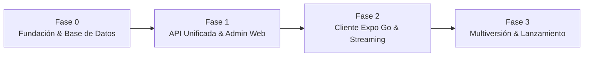

[← Volver al Índice de Tecnología](README.md) | [← Volver al Índice Principal](../index.md)

# 16 — Phased Delivery Roadmap

Plan de implementación por fases para el desarrollo y puesta en producción de **Astrolegia**, alineado con la arquitectura simplificada y las decisiones confirmadas.

---

## Resumen de Fases

---

## Fase 0 — Fundación & Base de Datos

| Entregable | Alcance y Tecnologías | Criterio de Éxito |
|---|---|---|
| **Estructura del Monorepo** | Turborepo + pnpm workspaces con `apps/` y `packages/`. | Compilación limpia de todos los paquetes con `pnpm build`. |
| **Aprovisionamiento de Railway** | Proyecto `astrolegia-staging` con servicio de base de datos PostgreSQL. | Conexión exitosa desde el entorno local mediante `DATABASE_URL`. |
| **Esquema de Base de Datos** | `packages/database` con modelos de Prisma (`User`, `Account`, `Session`, `NatalProfile`, `ChartCalculation`, `AdminAudit`). | `prisma migrate deploy` ejecutado sin errores. |
| **Seed de Administración Inicial** | Script de inicialización que inserta el primer usuario con rol `super_admin` para un correo Google real. | Registro verificado en base de datos con permisos administrativos. |
| **Contratos Iniciales** | `packages/contracts` con esquemas Zod para perfiles natales y respuestas API. | Tipos exportados y utilizables en todo el monorepo. |

---

## Fase 1 — API Backend Unificada & Panel de Administración

| Entregable | Alcance y Tecnologías | Criterio de Éxito |
|---|---|---|
| **API Backend Base** | Proyecto `apps/api` (NestJS / Node.js) con OpenAPI 3.1. | Documentación interactiva Swagger accesible en `/docs`. |
| **Autenticación Better Auth** | Integración de Google SSO en `/v1/auth/*` con proveedor Google OAuth. | Inicio de sesión funcional con cuenta de Google y creación de sesión en PostgreSQL. |
| **Endpoint de Capacidades** | Implementación de `GET /v1/capabilities`. | Retorna JSON con versión de API y builds mínimos soportados. |
| **Librería de Design System** | `packages/ui` con componentes React base (`Button`, `Card`, `Input`, `Modal`, `Table`). | Componentes testeados y exportables como `@astrolegia/ui`. |
| **Admin Web** | `apps/admin` en React con Tailwind propio, Google SSO y guard de roles (`viewer`, `editor`, `super_admin`). | Un administrador puede autenticarse con Google y ver el panel de gestión. |
| **Auditoría Administrativa** | Registro automático de mutaciones operativas en `admin_audit`. | Las acciones en el panel admin quedan registradas en PostgreSQL. |

---

## Fase 2 — Frontend de Consultantes (Expo Go) & Streaming de PDFs

| Entregable | Alcance y Tecnologías | Criterio de Éxito |
|---|---|---|
| **App Móvil / Web Cliente** | `apps/client` en React con **Expo Go** y TypeScript. | La app se ejecuta de inmediato en dispositivos físicos mediante la aplicación Expo Go. |
| **Integración de UI y CSS Cliente** | Consumo de `@astrolegia/ui` con estilos propios de consultante (tema astral oscuro y navegación adaptada a pulgar). | Coherencia visual completa con el Design System sin interferir con el panel admin. |
| **Flujo de Google SSO en Móvil** | Autenticación con Google en Expo Go (`expo-auth-session`) y guardado seguro de sesión en `expo-secure-store`. | El consultante inicia sesión con un toque y mantiene su sesión abierta. |
| **Cálculo de Carta Natal** | Rutas `/v1/client/astrology/natal-chart` para registrar fecha, hora y coordenadas geográficas. | La API calcula posiciones planetarias y casas, guardándolas en PostgreSQL. |
| **Generación y Streaming de PDFs** | Endpoint `GET /v1/client/astrology/natal-chart/:id/pdf` con generación en memoria (PDFKit) y streaming directo por chunks HTTP. | El usuario descarga y visualiza su PDF en tiempo real en la app móvil sin uso de buckets. |

---

## Fase 3 — Soporte Multiversión, Revisión en Tiendas & Producción

| Entregable | Alcance y Tecnologías | Criterio de Éxito |
|---|---|---|
| **Soporte Multiversión Concurrente** | Verificación de cabeceras (`X-App-Platform`, `X-App-Build`, `X-Api-Version`) y rutas coexistentes `/v1` y `/v2`. | La versión en producción ($N$) y la versión en review ($N+1$) operan simultáneamente sobre la misma base de datos. |
| **Perfiles EAS Build** | Configuración de compilación para iOS y Android con Expo Application Services (EAS). | Generación exitosa de binarios para TestFlight e internal track de Google Play. |
| **Despliegue a Producción** | Proyecto `astrolegia-production` en Railway con dominios `astrolegia.com`, `admin.astrolegia.com` y `api.astrolegia.com`. | Plataforma operativa en producción con TLS y monitorización básica de salud. |
