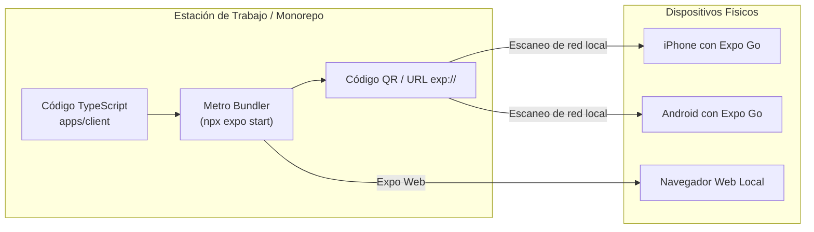

[← Volver al Índice de Tecnología](README.md) | [← Volver al Índice Principal](../index.md)

# 17 — Expo Go & Mobile Development

Para el frontend de consultantes y usuarios finales, **Astrolegia** utiliza **React Native** con **Expo Go** y TypeScript, permitiendo un ciclo de desarrollo ágil, iteración instantánea sin fricción nativa y portabilidad total entre iOS, Android y Web.

---

## El Rol de Expo Go en Astrolegia

**Expo Go** es el entorno de ejecución universal preinstalado en los dispositivos móviles del equipo de desarrollo y testing. Permite ejecutar el código de Astrolegia de inmediato mediante el escaneo de un código QR, sin necesidad de compilar código nativo en local con Xcode o Android Studio durante el desarrollo diario.



---

## Ventajas de Usar Expo Go

1. **Recarga Ultrarrápida (*Fast Refresh*):** Cualquier cambio en un componente de `@astrolegia/ui` o en una pantalla de la app se refleja en el dispositivo físico en menos de un segundo.
2. **Cero Dependencia de Entornos Nativos Locales:** Desarrolladores con computadoras Windows, Linux o macOS pueden programar para iOS y Android de forma idéntica sin configurar SDKs pesados de Android o simuladores de Mac.
3. **Validación Inmediata con Usuarios:** Compartir una compilación de prueba con consultantes o stakeholders requiere únicamente enviar un enlace de Expo Go o canal de preview.

---

## Configuración del Proyecto (`app.json`)

El archivo `apps/client/app.json` define la metadata de la aplicación:

```json
{
  "expo": {
    "name": "Astrolegia",
    "slug": "astrolegia",
    "version": "1.0.0",
    "orientation": "portrait",
    "icon": "./assets/icon.png",
    "userInterfaceStyle": "dark",
    "splash": {
      "image": "./assets/splash.png",
      "resizeMode": "contain",
      "backgroundColor": "#0D1117"
    },
    "ios": {
      "supportsTablet": true,
      "bundleIdentifier": "com.royslab.astrolegia"
    },
    "android": {
      "adaptiveIcon": {
        "foregroundImage": "./assets/adaptive-icon.png",
        "backgroundColor": "#0D1117"
      },
      "package": "com.royslab.astrolegia"
    },
    "scheme": "astrolegia"
  }
}
```

---

## Ecosistema de Librerías Expo en Astrolegia

Astrolegia se apoya en módulos oficiales de Expo completamente soportados en Expo Go:

| Librería | Propósito en Astrolegia |
|---|---|
| **`expo-auth-session`** | Flujo de autenticación Google SSO nativo y redirección segura. |
| **`expo-secure-store`** | Almacenamiento seguro cifrado en Keychain (iOS) y Keystore (Android) para tokens de sesión. |
| **`expo-file-system`** | Gestión de archivos temporales en memoria caché para recibir los flujos de PDFs en streaming. |
| **`expo-sharing`** | Menú nativo para que el usuario pueda compartir, imprimir o guardar su Carta Natal en PDF. |
| **`expo-constants`** | Lectura de versiones de compilación y plataforma para inyectar cabeceras (`X-App-Build`, `X-App-Version`). |

---

## Integración con el Monorepo y Metro Bundler

Para que Expo Go pueda resolver e importar sin problemas los paquetes compartidos del monorepo (`packages/ui` y `packages/contracts`), se configura `apps/client/metro.config.js`:

```javascript
const { getDefaultConfig } = require('expo/metro-config');
const path = require('path');

const projectRoot = __dirname;
const monorepoRoot = path.resolve(projectRoot, '../..');

const config = getDefaultConfig(projectRoot);

// Observar todos los paquetes del monorepo
config.watchFolders = [monorepoRoot];

// Permitir que Metro resuelva node_modules del workspace raíz
config.resolver.nodeModulesPaths = [
  path.resolve(projectRoot, 'node_modules'),
  path.resolve(monorepoRoot, 'node_modules'),
];

module.exports = config;
```

---

## Camino Hacia la Publicación en Tiendas (EAS Build)

Cuando el equipo está listo para generar los binarios oficiales para las tiendas:
- **Desarrollo y QA Inicial:** Se utiliza **Expo Go**.
- **Generación de Binarios para Tiendas:** Se utiliza **EAS Build** (*Expo Application Services*), que compila los archivos `.ipa` (iOS) y `.aab` (Android) en la nube de Expo.
- Esto permite enviar la aplicación a revisión en **Apple TestFlight** y **Google Play Internal Testing** sin ensuciar el repositorio con carpetas `/ios` y `/android` autogeneradas.
