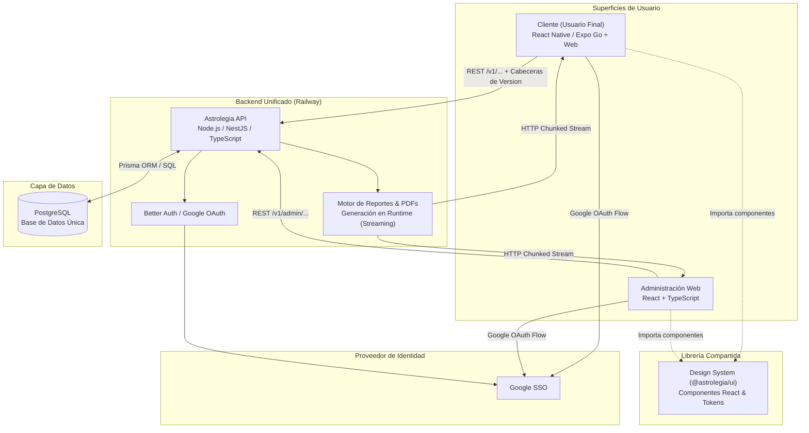

[← Volver al Índice Principal](../index.md)

# Astrolegia — Platform Architecture

Documentación técnica de la plataforma **Astrolegia**. Este índice enlaza y resume la arquitectura reducida y simplificada del sistema: una única API backend, base de datos PostgreSQL, dos frontends (usuario final en Expo Go y administración web) que comparten un Design System unificado como librería de componentes React, autenticación Google SSO inicial y generación/streaming de documentos en memoria sin almacenamiento persistente.

---

## Diagrama de Componentes

Topología de la arquitectura: servicios sobre **Railway** (o plataforma equivalente) y **PostgreSQL**.

| Componente | Rol y Responsabilidad |
|---|---|
| **Cliente (Usuario Final)** | Frontend en React + Expo Go + TypeScript para experiencia móvil y web responsiva. Consume `@astrolegia/ui` con estilos CSS propios. |
| **Administración Web** | Frontend web en React + TypeScript para operadores y administradores de Astrolegia. Consume `@astrolegia/ui` con CSS propio. |
| **Design System (`@astrolegia/ui`)** | Paquete compartido en el monorepo que expone componentes React y design tokens para ambos frontends como una librería. |
| **Astrolegia API** | **Única API backend** para todo el sistema (REST + OpenAPI 3.1). Maneja autenticación, reglas de negocio, endpoints cliente y administración (RBAC). |
| **Generación Runtime (PDF)** | Generación en memoria al vuelo de cartas astrales, reportes y documentos, transmitidos vía HTTP streaming directo. **Sin almacenamiento persistente en buckets**. |
| **PostgreSQL** | Única base de datos transaccional (fuente de la verdad del sistema). |
| **Google SSO** | Proveedor de identidad único inicial para usuarios finales y administradores (vía Better Auth / Google OAuth). |

---

## Índice de Documentación Técnica

| N° | Documento | Enfoque Principal |
|---|---|---|
| 01 | [01-architecture-overview.md](./01-architecture-overview.md) | Visión global de la arquitectura, principios y modelo C4 simplificado. |
| 02 | [02-client-platform.md](./02-client-platform.md) | Frontend de usuario final con React + Expo Go + TypeScript y CSS específico. |
| 03 | [03-admin-platform.md](./03-admin-platform.md) | Frontend de administración web con React + TypeScript y control RBAC. |
| 04 | [04-design-system.md](./04-design-system.md) | Design System unificado (`@astrolegia/ui`): componentes compartidos y CSS desacoplado. |
| 05 | [05-data-architecture.md](./05-data-architecture.md) | Arquitectura de datos pura en PostgreSQL (modelos, índices, sin BigQuery). |
| 06 | [06-monorepo-structure.md](./06-monorepo-structure.md) | Estructura del monorepo con Turborepo + pnpm (`apps/` y `packages/`). |
| 07 | [07-authentication.md](./07-authentication.md) | Flujo unificado de autenticación con Google SSO para cliente y administración. |
| 08 | [08-better-auth.md](./08-better-auth.md) | Integración de Better Auth con Google Provider montado en la API unificada. |
| 09 | [09-runtime-document-generation.md](./09-runtime-document-generation.md) | Generación y streaming HTTP en runtime de PDFs y reportes (sin buckets). |
| 10 | [10-railway-deployment.md](./10-railway-deployment.md) | Despliegue en Railway (API, Admin Web, PostgreSQL, Expo). |
| 11 | [11-database-connectivity.md](./11-database-connectivity.md) | Conectividad y pooling a base de datos PostgreSQL. |
| 12 | [12-infrastructure-as-code.md](./12-infrastructure-as-code.md) | Infraestructura como Código (IaC) simplificada con Terraform. |
| 13 | [13-api-design.md](./13-api-design.md) | Diseño de la API REST + OpenAPI 3.1 con namespaces `/v1` y `/v1/admin`. |
| 14 | [14-api-versioning.md](./14-api-versioning.md) | Versionamiento simultáneo garantizado: app en producción y app en revisión en tiendas. |
| 15 | [15-security.md](./15-security.md) | Seguridad pragmática y esencial: HTTPS, CORS, Google SSO, RBAC y rate limiting. |
| 16 | [16-phased-delivery.md](./16-phased-delivery.md) | Plan de entrega y fases de desarrollo de Astrolegia. |
| 17 | [17-expo-development.md](./17-expo-development.md) | Flujo y ciclo de desarrollo rápido con Expo Go y ecosistema Expo. |
| 18 | [18-decisions-log.md](./18-decisions-log.md) | Registro de decisiones arquitectónicas clave confirmadas para Astrolegia. |

---

## Decisiones Confirmadas

- **Una Sola API Backend:** Consolida todas las conexiones y lógica de negocio. Elimina la división previa en APIs independientes y proxies intermedios.
- **Dos Frontends con Design System Compartido:** Frontend de usuario en React + Expo Go y frontend de administración en React. Ambos importan los componentes del Design System (`packages/ui`), conservando cada uno su capa de CSS para estilos y layouts específicos.
- **Autenticación Exclusiva con Google SSO:** Tanto clientes como administradores se autentican mediante Google SSO inicialmente. Los roles de administración (`viewer`, `editor`, `super_admin`) se autorizan en PostgreSQL.
- **Base de Datos Única (PostgreSQL):** No existe BigQuery, ni workers de sincronización periódica, ni pipelines ETL analíticos complejos.
- **Cero Almacenamiento Persistente:** No se utilizan buckets de archivos (sin S3/Railway Buckets). Toda descarga de reportes o PDFs de cartas astrales se procesa en runtime en memoria y se envía por streaming HTTP directo.
- **Versionamiento de API Multiversión Simultáneo:** La API soporta de forma activa y simultánea la versión en producción ($N$) y la versión en proceso de revisión en tiendas ($N+1$) con endpoints de capabilities y negociación por cabeceras.
- **Seguridad Pragmática:** Se eliminan firewalls de aplicación complejos y sistemas pesados de escaneo antivirus de archivos (sin ClamAV ni cuarentena). Se mantiene seguridad estándar de la industria (TLS, CORS, RBAC, validación estricta de esquemas Zod).
